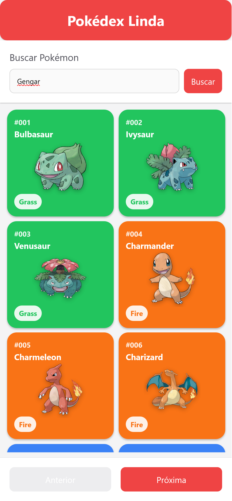

# Pokédex Linda 📱

Uma aplicação mobile de Pokédex desenvolvida com React Native e Expo, permitindo explorar e descobrir informações sobre diversos Pokémon.

### Pré-requisitos

- Node.js instalado

## 🚀 Como instalar e rodar

1. Clone o repositório

   ```bash
   git clone https://github.com/debbtrbl/basic-pokedex-nativebase.git
   ```
2. Entre na pasta do projeto

   ```bash
   cd basic-pokedex-nativebase
   ```
   
1. Instale as dependências

   ```bash
   npm install
   ```

2. Execute o projeto

   ```bash
   npx expo start
   ```
   ou
    ```bash
   npm start
   ```

Opções para Visualizar:
   
   - Expo Go: Escaneie o QR code com o app Expo Go

   -  Emulador: Pressione a para Android ou i para iOS

   - Web: Pressione w para versão web


## ✅ Funcionalidades Principais

 - Lista de Pokémon com imagem, nome, tipo e número;
   
 - Paginação com botões "Anterior" e "Próxima";

- Busca por nome de Pokémon;

- Modal de detalhes com informações completas;
- Tratamento de erros com mensagens amigáveis e botão de tentar novamente.

## 🔧 Tecnologias

 - Expo + React Native

-  Native Base para UI components

- TypeScript para tipagem

- PokeAPI para dados dos Pokémon

##  📸 Screenshots

<div align="center">
  
### Tela Principal com Lista de Pokémon


### Modal de Detalhes


### Tela de Busca


</div>